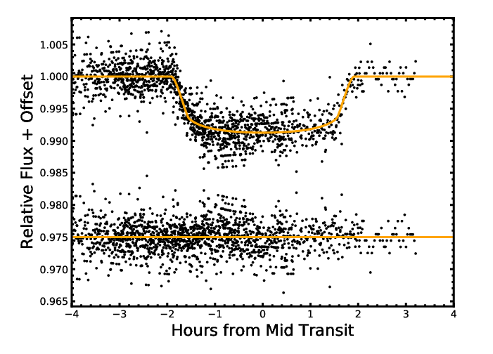

## Day 1-5: Plot Modeled Transits  
2019/09/23 - 2019/09/27
### Task: Plot Modeled Transits  
Skills you need to learn:
- import Python package: numpy, matplotlib 
- read transit file as array
- plot a figure

File:
- Transit_fit.flux: transit model
- Transit_orignal.flux: transit we observed
- Transit_residual.flux: (transit we observed) - (transit model)

You can read some material below:
- https://matplotlib.org/2.2.3/gallery/index.html
- https://www.runoob.com/numpy/numpy-matplotlib.html
- https://blog.csdn.net/tanghong1996/article/details/82224283

Example Figure:

